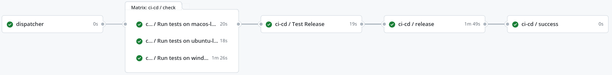

## Table of contents
{: .no_toc .text-delta }
1. TOC
   {:toc}
---

# DevOps

`DevOps` engineering is a software development methodology that aims at communication and collaboration among developers and information technologies workers. This set of techniques responds to interdependencies between software development and relative IT operations, allowing a faster and more efficient organization of software products and services.

The following paragraphs describe which DevOps techniques have been used in the making of the system, focusing on the advantages that each procedure has brought.

## DVCS Strategy

### Workflow
A GitHub organization named [RustFields](https://github.com/RustFields) was associated with the entire project. By doing so, every aspect of the project could be handled in a specific repository inside the organization.

The team agreed on working with `Git Flow` workflow inside the implementation repositories, adapting it following the specific needs. Before merging code on the `main/master` branch, feature branches need to be approved by other team members using the `Pull Request` GitHub's service. In the "lightweight" repositories, such as [rustfields.github.io](https://github.com/RustFields/rustfields.github.io), the team chose not to use this complex mechanism.

All the feature branches will follow a common structure based on the following template:

`feature/{feature-name}`

### Commits

The team adopted the [conventional-commit convention](https://www.conventionalcommits.org/en/v1.0.0/). This strategy provides an easy set of rules for creating an explicit commit history and allows to automatically define the number of versions released.

The team agreed on an extension of the standard convention, using the following set of commit types:

- **MAJOR release**
  - Any commit type and scope terminating with `!` causes a `BREAKING CHANGE`
- **MINOR release**
  - Commit type `chore` with scope `api-deps` (Dependency updates)
  - Commit type `feat` (Features) with any scope
- **PATCH release**
  - Commit type `chore` with scope `core-deps` (Dependency updates)
  - Commit type `fix` (Bug Fixes) with any scope
  - Commit type `docs` (Documentation) with any scope
  - Commit type `perf` (Performance improvements) with any scope
  - Commit type `revert` (Revert previous changes) with any scope
- **No release**
  - Commit type `test` (Tests)
  - Commit type `ci` (Build and continuous integration)
  - Commit type `build` (Build and continuous integration)
  - Commit type `chore` with scope `deps` (Dependency updates)
  - Commit type `chore` (General maintenance) with scopes different than the ones mentioned above
  - Commit type `style` (Style improvements) with any scope
  - Commit type `refactor` (Refactoring) with any scope

To ensure that the commits made are conformant to the required pattern, the team used `Git Hooks`.

### Versioning

Following the conventional commit standard, the version number is defined in the format `X.Y.Z` where:

* `X`: indicates a **major version** and is incremented when a breaking change occurs.
* `Y`: indicates a **minor version** and is incremented every time a new feature is introduced in the system.
* `Z`: indicates a **patch version** where typically errors are fixed and those changes do not modify the system APIs.

[comment]: <> (### Commit Lint Check)

## CI/CD

### GitHub Actions

The team decided to use the `GitHub Actions` service for the CI/CD.
The workflow's design is based on the build systems, languages and targets platform of the project.
All projects have a common workflow called `dispatcher`, which is used as a filter to disable the branch builds for some branches. It is useful to prevent unauthorized access to the GitHub Actions' secrets.
The workflows of the various projects are presented in detail below:

`RuFi-core` is built using Rust and Cargo. First of all, tests are performed on Ubuntu, MacOS and Windows. If tests pass on all platforms, Semantc Release is run in dry-run mode to see if building the release causes any problems. If the dry run is successful, the release is created. During the creation of the release, the crate is generated and published on both GitHub and crates.io.

The workflow diagram is presented below:

`ScaFi-core` is built using Scala and SBT. First of all, tests are performed on Ubuntu, MacOS and Windows using different versions of the JDK. If all tests pass, artifact generation with SBT is tested. If the generation of the artifacts is also successful, the release is created using Semantic Release and the artifacts are published on GitHub.

The workflow diagram is presented below:

`RuFi-core-wrapper` is built using Scala, Rust, SBT and Cargo. The workflow of this project is more complex than the previous ones, this is due to the type of dependency between the module developed in Scala and the one developed in Rust. First of all, the Rust module is tested on Ubuntu, MacOS and Windows. At the same time, the dynamic library is generated for the same platforms. This is because the Scala module depends on the native library and therefore it is not possible to test the Scala code without having the latter. If the tests pass and the native library is generated correctly, the tests are performed on the Scala module. If the Rust and Scala tests pass, artifact generation is tested. If the generation of the artifacts is successful, the release is created using Semantic Release and both the JARs and the native library are published on GitHub

The workflow diagram is presented below:

### Code Quality Control

### Tests

### Automatic Dependency Update

The team agreed on using `renovate` for automatic dependencies updates.

### Semantic Versioning and Releasing

Thanks to the use of [Semantic Release](https://github.com/semantic-release/semantic-release) it was possible to automate all the versioning and releasing work. In particular, the action automatically calculates if a new release is needed based on the committed commits in the `main/master` branch. If there is a commit that triggers a new release (major, minor or patch) then the action creates the new tag, adding the appropriate version number between the actual and the last tag, and then will create the GitHub Release with the reference of the last commit pushed on `main/master` branch.

## Licenses

Every repository in the organization is endowed with the Apache License 2.0.
