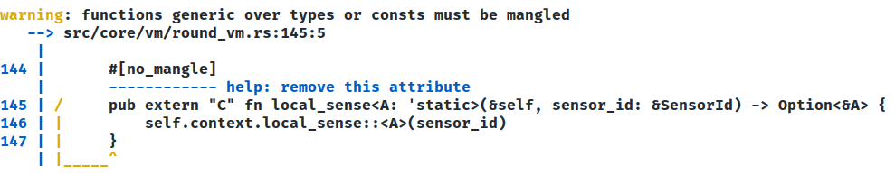
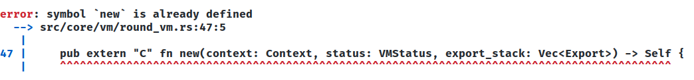

# Implementation Issues

## Scala Native, Rust and C Interoperability

Among the possible solutions analyzed to develop the integration layer between Rust and Scala, it was decided to use Scala Native and exploit the interoperability of the languages with the C language.
Interoperability details are defined in the documentation of the two projects:
- Rust: https://docs.rust-embedded.org/book/interoperability/index.html
- Scala Native: https://scala-native.org/en/stable/user/interop.html

As the documentation states, interoperability has well-defined limits and it is not possible to take full advantage of the functionality of the two languages.

A Rust function can be made interoperable with the C language by making the following changes:

As expected, you cannot use generics in Rust if your code is to be interoperable with the C language.

```rust
#[no_mangle]
pub extern "C" fn local_sense<A: 'static>(&self, sensor_id: &SensorId) -> Option<&A> {
    self.context.local_sense::<A>(sensor_id)
}
```


```rust
#[no_mangle]
pub extern "C" fn new(context: Context) -> Self {
    Self {
        vm: RoundVM::new_empty(context)
    }
}
```


```rust
    #[no_mangle]
    pub extern "C" fn new(context: Context, status: VMStatus, export_stack: Vec<Export>) -> Self {
        Self {
            context,
            status,
            export_stack,
            isolated: false,
        }
    }
```



## Rust limitations emerged upon implementing language constructs

During the development of a minimal Field Calculus core in Rust, an issue emerged that has not been resolved to date.

The main problem is Rust's by-design limitation to borrowing: it is not possible for mutable and immutable borrows of the same variable to coexist in the same scope. This limitation is problematic in the implementation of the fundamental constructs of the language as they have been realized to date in Scala:

```rust
fn nbr<A: 'static + Clone>(&mut self, expr: impl Fn() -> A) -> A {
        let mut vm = &self.round_vm;
        vm.nest(
            Nbr(vm.index().clone()),
            vm.only_when_folding_on_self(),
            true,
            || {
                match vm.neighbor() {
                    Some(nbr) if nbr.clone() != vm.self_id() => {
                        vm.neighbor_val().unwrap_or(&expr()).clone()
                    }
                    _ => expr()
                }
            }
        )
    }
```

This code is invalid since a mutable borrow of the round_vm is made at the call to nest() and an immutable one inside the closure with the implementation of the construct logic, since in Rust all references to variables outside the scope of the closure are obtained by immutable borrowing.

Another problem encountered during the implementation of the core constructs in Rust was the management of their dependency with the VM: in fact, the choice fell on the creation of a trait that encapsulates the definition of the constructs and a data structure containing a RoundVM that must implement it:

```rust
pub trait Language {
    fn nbr<A: 'static + Clone>(&mut self, expr: impl Fn() -> A) -> A;
    ...
}

pub struct L {
    pub round_vm: RoundVM,
}

impl Language for L {
    ...
}
```

This choice is ultimately problematic when two constructs are to be composed, due to the occurrence of the aforementioned limitation to borrowing:

```rust
let mut l = L::new();
// rep(0){x => nbr(x)+1}
let result = l.rep(||0, |a| l.nbr(||a) + 1);
```
In this block of code a mutable borrowing is performed at l.rep() and an immutable one in the closure at l.nbr(), making the code invalid.

### Possible solutions

### Cells
The concept of a Cell was introduced in Rust to implement a form of "internal mutability." A Cell is essentially a wrapper for a generic type that we might want to mutate. The mutable variable is then wrapped by the immutable Cell and mutated through the Cell interface itself. At this point it is possible to make multiple immutable borrows of the cell and use the mutable state within it. The following is an example of an nbr function that makes use of cells to pass a reference to round_vm to the closure:

```rust
fn nbr<A: 'static + Clone>(&mut self, expr: impl Fn() -> A) -> A {
        let vm_cell = Cell::new(&mut self.round_vm);
        vm_cell.get().nest(
            Nbr(vm_cell.get().index().clone()),
            vm_cell.get().only_when_folding_on_self(),
            true,
            match vm_cell.get().neighbor() {
                Some(nbr) if nbr.clone() != vm_cell.get().self_id() => {
                    vm_cell.get().neighbor_val().unwrap_or(&expr()).clone()
                }
                _ => expr()
            }
        )
    }
```

This code solves the problem of mutable and immutable reference to the same variable, however the get() method needs the wrapped type to implement the Copy trait, but unfortunately that trait cannot be implemented by RoundVM since Export cannot implement it since it contains references to Any.

### Create a macro to perform dependency injection in functions

The ability to perform dependency injection in functions through a macro such as:

```rust
    #[inject(RoundVM)]
    fn nbr<A: 'static + Clone>(&mut self, expr: impl Fn() -> A) -> A {
        ...
    }
```
would allow fundamental constructs to be defined as pure functions and not methods of an object, making it theoretically possible to write such code:

```rust
    let result = rep(||0, |a| nbr(||a) + 1);
```

as no problematic borrowing is performed.

It is important to note that to date there does not appear to be a dependency injection framework in Rust capable of realizing the above code, but it would perhaps be possible to explore the solution by realizing it through Rust's macro system.
