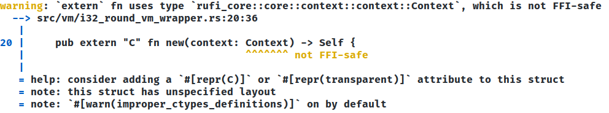

# Implementation

## Implementation Issues

### Scala Native, Rust and C interoperability

Among the possible solutions analyzed for developing an integration layer between Rust and Scala, it was decided to use Scala Native and leverage the languages' interoperability with C. The details of interoperability are defined in the documentation of both projects:

- [Rust](https://docs.rust-embedded.org/book/interoperability/index.html)
- [Scala Native](https://scala-native.org/en/stable/user/interop.html)

As the documentation states, interoperability has well-defined limits, and it is not possible to fully utilize the functionalities of both languages.

To make a Rust function interoperable with the C language, the following changes can be made:

```rust
// before
pub fn rust_function() {

}

// after
#[no_mangle]
pub extern "C" fn rust_function() {

}
```
The Rust compiler mangles symbol names differently than what native code linkers expect. Therefore, any function that is exported from Rust to be used outside of Rust must be instructed not to be mangled by the compiler using `#[no_mangle]`. By default, functions written in Rust will use the Rust ABI, which is also not stabilized. However, when creating FFI APIs that are intended for external use, we need to instruct the compiler to use the system ABI by using extern "C".

It is important to note that you cannot use generics in Rust if your code needs to be interoperable with the C language.

The following Rust code:

```rust
#[no_mangle]
pub extern "C" fn local_sense<A: 'static>(&self, sensor_id: &SensorId) -> Option<&A> {
    self.context.local_sense::<A>(sensor_id)
}
```
gives the following warning:


This problem can be resolved by duplicating the functions for each data type that is compatible with both C and Rust, which unfortunately leads to code repetition.

Another challenge arises when dealing with data structures. To ensure compatibility with C, the `#[repr(C)]` directive must be applied to any data structure that needs to be made compatible. For example:

```rust
#[repr(C)]
pub struct I32RoundVMWrapper {
    pub(crate) vm: RoundVM,
}
```
If you use complex data structures, possibly defined in another crate, without the `#[repr(C)]` directive, it can lead to compatibility issues. Let's consider the following example:

```rust
#[no_mangle]
pub extern "C" fn new(context: Context) -> Self {
    Self {
        vm: RoundVM::new_empty(context)
    }
}
```
gives the following warning:



It was also discovered that when using `#[no_mangle]`, it is not possible to have functions with the same name. If your project contains different modules, each with its own data structures, you cannot define functions with the same name in different modules. For example, if the function `new` is used to create instances of a `struct`:

```rust
    #[no_mangle]
    pub extern "C" fn new(context: Context, status: VMStatus, export_stack: Vec<Export>) -> Self {
        Self {
            context,
            status,
            export_stack,
            isolated: false,
        }
    }
```
gives the following error:


### Rust limitations emerged upon implementing language constructs

During the development of a minimal Field Calculus core in Rust, an unresolved issue surfaced that persists to this day.

The primary problem arises from Rust's inherent limitation with borrowing: it is not possible for mutable and immutable borrows of the same variable to coexist within the same scope. This limitation poses challenges when implementing the fundamental constructs of the language as they have been traditionally realized in Scala.

```rust
fn nbr<A: 'static + Clone>(&mut self, expr: impl Fn() -> A) -> A {
        let mut vm = &self.round_vm;
        vm.nest(
            Nbr(vm.index().clone()),
            vm.only_when_folding_on_self(),
            true,
            || {
                match vm.neighbor() {
                    Some(nbr) if nbr.clone() != vm.self_id() => {
                        vm.neighbor_val().unwrap_or(&expr()).clone()
                    }
                    _ => expr()
                }
            }
        )
    }
```

This code is invalid because it attempts to make a mutable borrow of round_vm during the call to nest(), while simultaneously having an immutable borrow inside the closure that implements the construct logic. In Rust, all references to variables outside the closure's scope are obtained through immutable borrowing.

Another issue encountered during the implementation of the core constructs in Rust was managing their dependency with the VM. As a solution, a choice was made to create a trait that encapsulates the definition of the constructs, along with a data structure that contains a RoundVM instance that must implement the trait.

```rust
pub trait Language {
    fn nbr<A: 'static + Clone>(&mut self, expr: impl Fn() -> A) -> A;
    ...
}

pub struct L {
    pub round_vm: RoundVM,
}

impl Language for L {
    ...
}
```

This choice ultimately poses a problem when attempting to compose two constructs, due to the aforementioned borrowing limitation:

```rust
let mut l = L::new();
// rep(0){x => nbr(x)+1}
let result = l.rep(||0, |a| l.nbr(||a) + 1);
```

In this code block, a mutable borrow is performed at l.rep(), while an immutable borrow is made inside the closure at l.nbr(), making the code invalid.

#### Possible solutions

#### Cells

To address the limitation to borrowing in Rust, the concept of a Cell was introduced. A Cell serves as a form of "internal mutability" and acts as a wrapper for a generic type that requires mutation. By wrapping the mutable variable with an immutable Cell, we can mutate the variable through the Cell interface itself. This allows us to have multiple immutable borrows of the Cell while still being able to access and modify its mutable state.

Here's an example of an nbr function that utilizes Cells to pass a reference to round_vm to the closure:

```rust
fn nbr<A: 'static + Clone>(&mut self, expr: impl Fn() -> A) -> A {
        let vm_cell = Cell::new(&mut self.round_vm);
        vm_cell.get().nest(
            Nbr(vm_cell.get().index().clone()),
            vm_cell.get().only_when_folding_on_self(),
            true,
            match vm_cell.get().neighbor() {
                Some(nbr) if nbr.clone() != vm_cell.get().self_id() => {
                    vm_cell.get().neighbor_val().unwrap_or(&expr()).clone()
                }
                _ => expr()
            }
        )
    }
```

This code resolves the issue of having mutable and immutable references to the same variable. However, note that the get() method requires the wrapped type to implement the Copy trait. Unfortunately, the Copy trait cannot be implemented by RoundVM because Export cannot implement it, as it contains references to Any.

#### Create a macro to perform dependency injection in functions

The ability to perform dependency injection in functions through a macro such as:

```rust
    #[inject(RoundVM)]
    fn nbr<A: 'static + Clone>(&mut self, expr: impl Fn() -> A) -> A {
        ...
    }
```
would allow fundamental constructs to be defined as pure functions and not methods of an object, making it theoretically possible to write such code:

```rust
    let result = rep(||0, |a| nbr(||a) + 1);
```

as no problematic borrowing is performed.

It is important to note that currently, there doesn't appear to be a dependency injection framework in Rust capable of implementing the aforementioned code. However, it might be possible to explore potential solutions using Rust's macro system. Macros can provide a mechanism for code generation and abstraction, which could potentially be leveraged to address the dependency injection requirements in the code.
